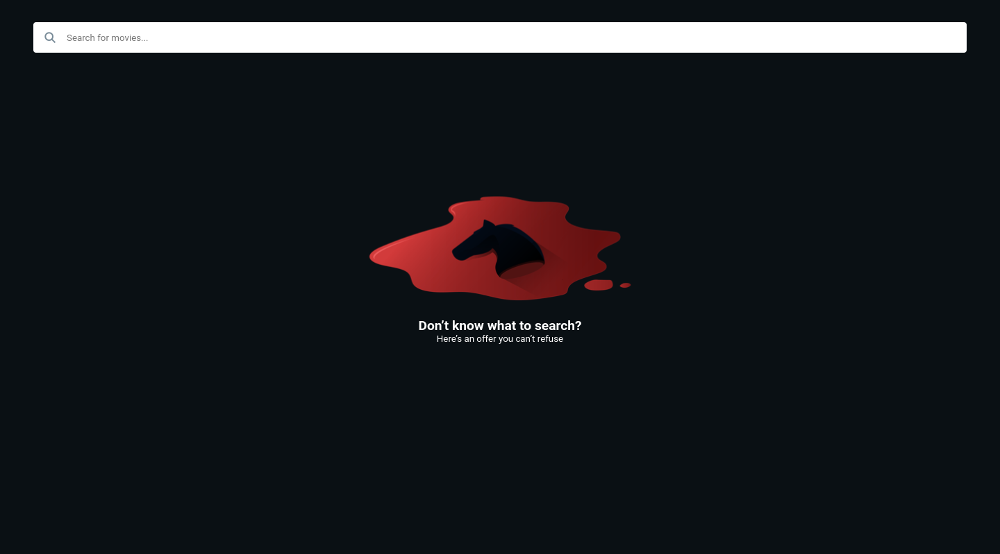
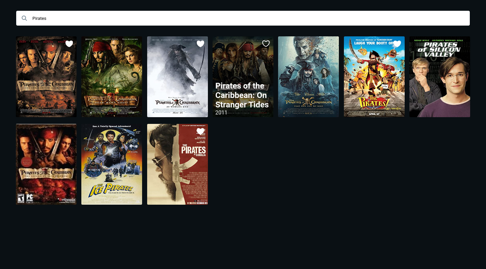

<p align="center">	
   <a href="https://www.linkedin.com/in/vinicios-alves/">
      
   </a>
  
  <a href="mailto:viniciossilvadev@gmail.com">
   
  </a>
</p>

<p align="center">
  Significa Front-End Challenge.
</p>

<div align="center">
  <sub> Made by
    <a href="https://github.com/VinewZ">Vinicios Silva.
  </sub>
</div>

# 📌 Contents

* [Screenshots](#camera-screenshot) 
* [Technologies](#rocket-technologies) 
* [How to Run](#computer-how-to-run)

# :camera: Screenshots
<div align="center">
   
   
</div>

<br/>
<hr/>

# :rocket: Technologies
This project was made using the follow technologies:

* [Yarn](https://yarnpkg.com/)      
* [Vite](https://vitejs.dev/)      
* [Typescript](https://www.typescriptlang.org/)      
* [React](https://reactjs.org/)      
* [Styled-Components](https://styled-components.com/)

# :computer: How to run

```bash
# Clone Repository
$ git clone -b vinicios-silva https://github.com/VinewZ/Significa-front-challenge.git

# Open directory with the code
$ cd my-code

# Install Dependencies and Run
$ yarn wrap
```
Go to http://localhost:3000/ to see the result.

Made by [Vinicios Silva](https://www.linkedin.com/in/vinicios-alves/). 

Thank you! 🌠