# Significa Frontend Challenge

## Table of Contents

- [Setup and Run](#Setup-and-Run)
- [Technologies](#Technologies)
- [Files Tree Architecture](#Files-Tree-Architecture)
- [Screenshots](#Screenshots)

### Setup and Run

##### Developer mode

- Install dependencies:

```
$ yarn
```

- Create `.env` based on `.env-default`
- Configure the envs

```
NODE_ENV
OMDB_API_KEY=
SITE_API_URL=
OMDB_URL=
PORT=
```

- Run `$ yarn dev`

##### Production mode

- Install dependencies:

```
$ yarn
```

- Create `.env` based on `.env-default`
- Configure the envs

```
NODE_ENV=
OMDB_API_KEY=
SITE_API_URL=
OMDB_URL=
PORT=
```

- Run `$ yarn build`
- Run `$ yarn start`

### Tests and Coverage

- Run tests `$ yarn test`
- Run test coverage `$ yarn test-coverage`

### Technologies

- [NextJS](https://nextjs.org/) as the frontend framework to build the app
- [Jest](https://jestjs.io/) as a test tool
- [React-testing-library](https://testing-library.com/docs/react-testing-library/intro/) as a tool to test UI
- [Prettier](https://prettier.io/) to code formatter
- [Eslint](https://eslint.org/) to code pattern
- [Husk](https://github.com/typicode/husky) a git hook that run prettier, eslint and tests when doing commit
- [Prop-types](https://reactjs.org/docs/typechecking-with-proptypes.html#gatsby-focus-wrapper) to code typecheck

### Files Tree Architecture

```
src
 ┣ assets
 ┃ ┣ icons
 ┃ ┃ ┣ icon-arrow-grey.svg
 ┃ ┃ ┣ icon-arrow-white.svg
 ┃ ┃ ┣ icon-heart-full.svg
 ┃ ┃ ┣ icon-heart-grey.svg
 ┃ ┃ ┣ icon-heart-white.svg
 ┃ ┃ ┣ icon-imdb.svg
 ┃ ┃ ┣ icon-magnifier-grey.svg
 ┃ ┃ ┣ icon-poster-not-found.svg
 ┃ ┃ ┗ icon-rotten-tomatoes.svg
 ┃ ┣ illustrations
 ┃ ┃ ┣ illustration-empty-state.svg
 ┃ ┃ ┗ illustration-movie-not-found.svg
 ┃ ┗ logo.svg
 ┣ components
 ┃ ┣ pages
 ┃ ┃ ┣ Movie
 ┃ ┃ ┃ ┣ __test__
 ┃ ┃ ┃ ┃ ┗ Movie.test.js
 ┃ ┃ ┃ ┣ Movie.css
 ┃ ┃ ┃ ┣ Movie.js
 ┃ ┃ ┃ ┗ index.js
 ┃ ┃ ┗ Search
 ┃ ┃ ┃ ┣ EmptyState
 ┃ ┃ ┃ ┃ ┣ __test__
 ┃ ┃ ┃ ┃ ┃ ┗ EmptyState.test.js
 ┃ ┃ ┃ ┃ ┣ EmptyState.css
 ┃ ┃ ┃ ┃ ┣ EmptyState.js
 ┃ ┃ ┃ ┃ ┗ index.js
 ┃ ┃ ┃ ┣ MovieCard
 ┃ ┃ ┃ ┃ ┣ __test__
 ┃ ┃ ┃ ┃ ┃ ┗ MovieCard.test.js
 ┃ ┃ ┃ ┃ ┣ MovieCard.css
 ┃ ┃ ┃ ┃ ┣ MovieCard.js
 ┃ ┃ ┃ ┃ ┗ index.js
 ┃ ┃ ┃ ┣ MovieCardSkeleton
 ┃ ┃ ┃ ┃ ┣ MovieCardSkeleton.css
 ┃ ┃ ┃ ┃ ┣ MovieCardSkeleton.js
 ┃ ┃ ┃ ┃ ┗ index.js
 ┃ ┃ ┃ ┣ SearchBar
 ┃ ┃ ┃ ┃ ┣ __test__
 ┃ ┃ ┃ ┃ ┃ ┗ SearchBar.test.js
 ┃ ┃ ┃ ┃ ┣ SearchBar.css
 ┃ ┃ ┃ ┃ ┣ SearchBar.js
 ┃ ┃ ┃ ┃ ┗ index.js
 ┃ ┃ ┃ ┣ __test__
 ┃ ┃ ┃ ┃ ┗ Search.test.js
 ┃ ┃ ┃ ┣ Search.css
 ┃ ┃ ┃ ┣ Search.js
 ┃ ┃ ┃ ┗ index.js
 ┃ ┗ shared
 ┃ ┃ ┣ Layout
 ┃ ┃ ┃ ┣ __test__
 ┃ ┃ ┃ ┃ ┗ Layout.test.js
 ┃ ┃ ┃ ┣ Layout.css
 ┃ ┃ ┃ ┣ Layout.js
 ┃ ┃ ┃ ┗ index.js
 ┃ ┃ ┗ NotFound
 ┃ ┃ ┃ ┣ __test__
 ┃ ┃ ┃ ┃ ┗ NotFound.test.js
 ┃ ┃ ┃ ┣ NotFound.css
 ┃ ┃ ┃ ┣ NotFound.js
 ┃ ┃ ┃ ┗ index.js
 ┣ hooks
 ┃ ┣ useFavourite.js
 ┃ ┗ useFetch.js
 ┣ pages
 ┃ ┣ api
 ┃ ┃ ┣ movie.js
 ┃ ┃ ┗ movies.js
 ┃ ┣ movie
 ┃ ┃ ┗ [id].js
 ┃ ┣ 404.css
 ┃ ┣ 404.js
 ┃ ┣ _app.css
 ┃ ┣ _app.js
 ┃ ┣ _document.js
 ┃ ┗ index.js
 ┣ public
 ┃ ┗ favicons
 ┣ services
 ┃ ┣ getMovie.js
 ┃ ┗ getMovies.js
 ┣ config.js
 ┗ style-guide.css
```

### Screenshots

#### Desktop

<div style=" margin: 1rem 0; display: flex; flex-wrap: wrap; justify-content: space between;">
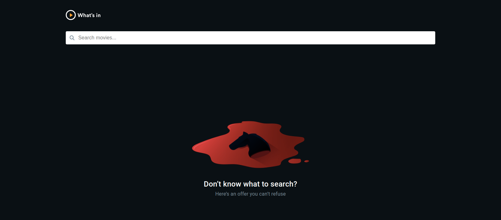
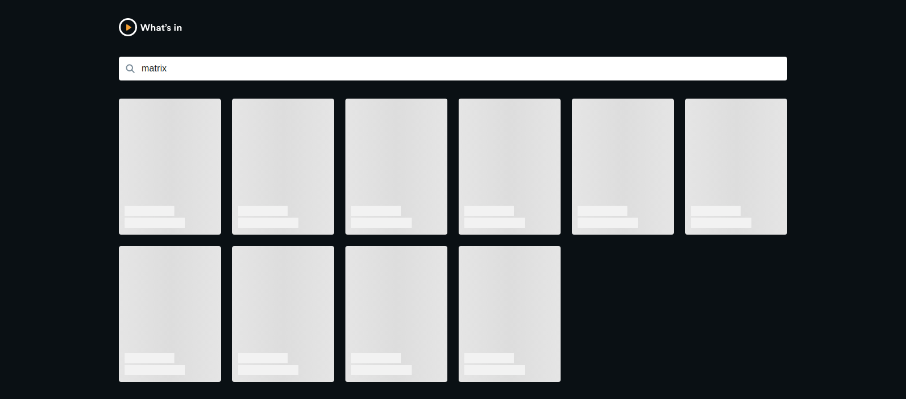
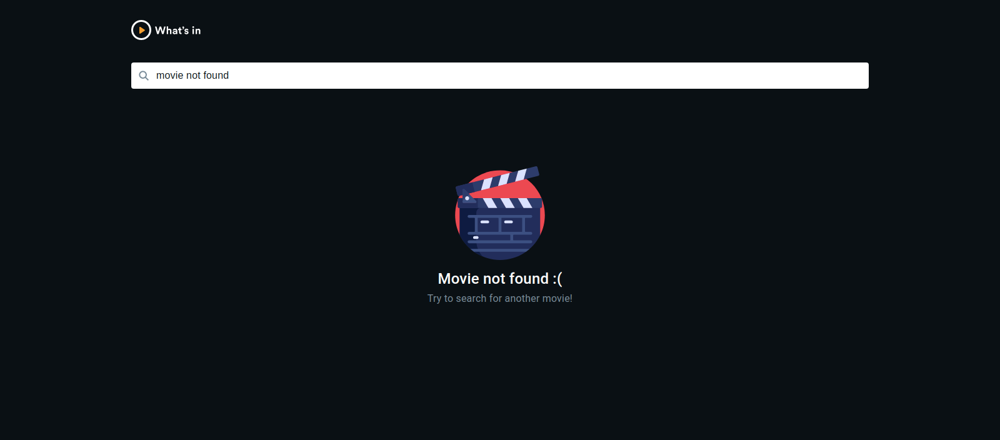
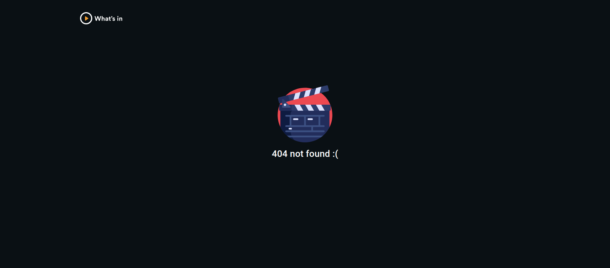
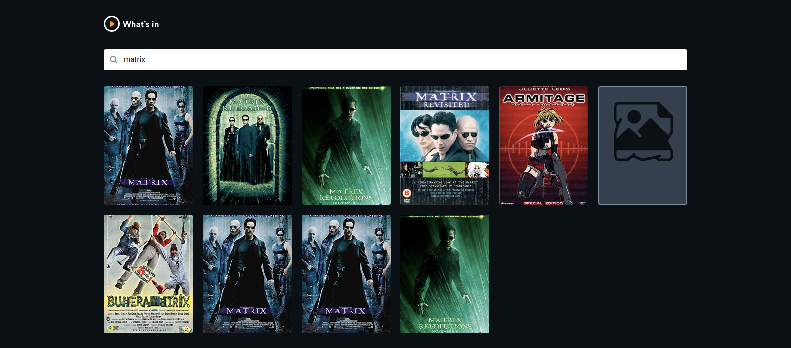
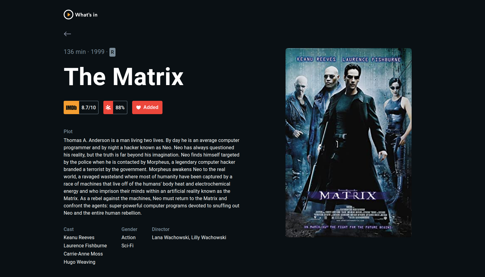
<div>

#### Mobile

<div style=" margin: 1rem 0; display: flex; flex-wrap: wrap; justify-content: space between;">
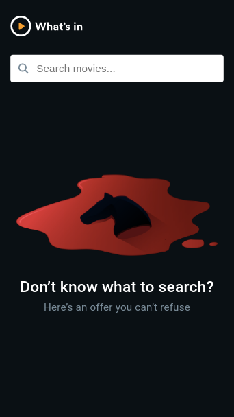
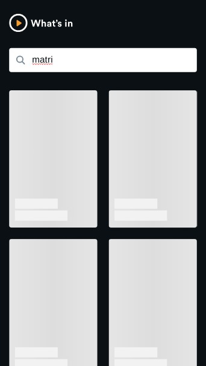
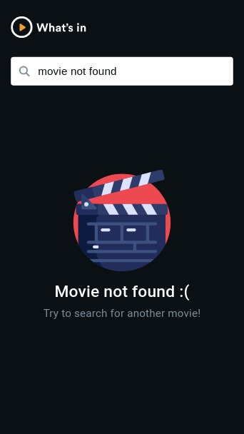
<div>
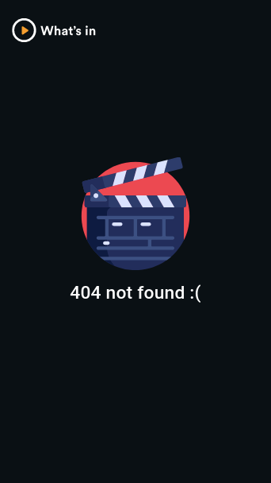
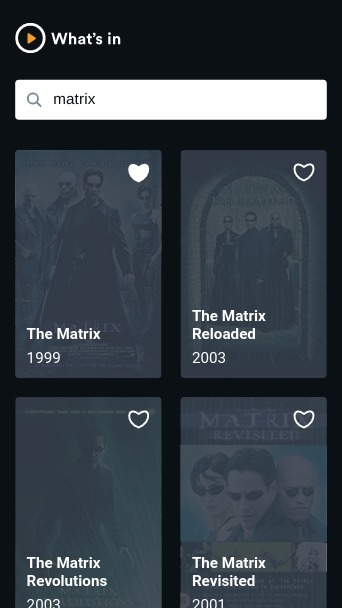
</div>
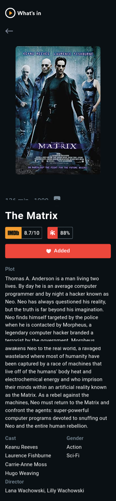

<div>
