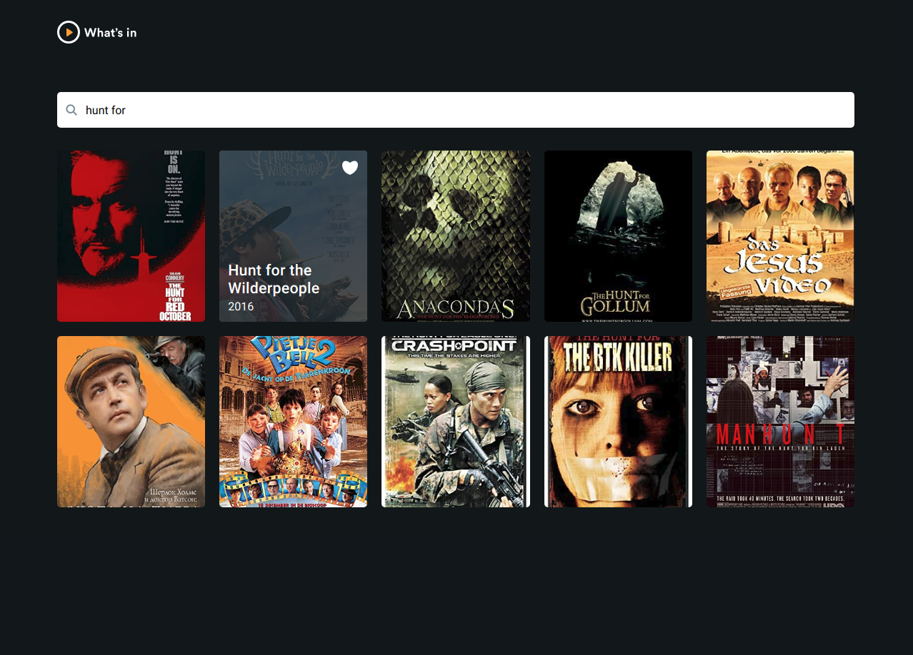
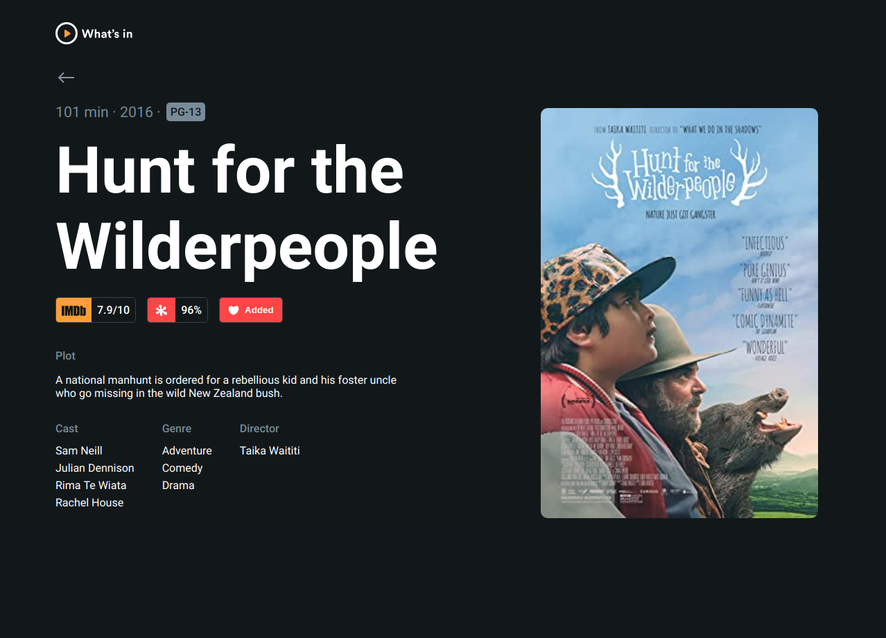
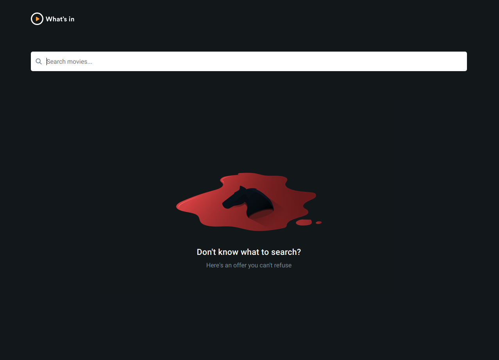
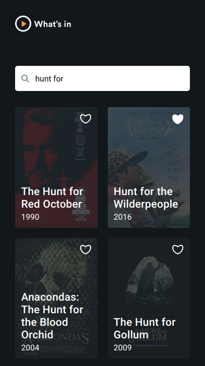
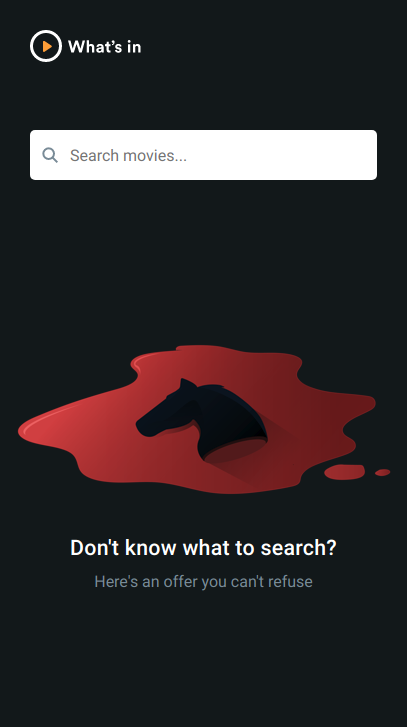
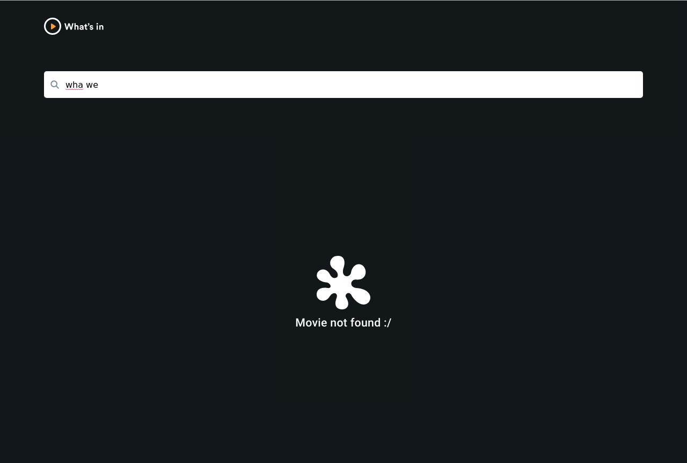

# Significa Challenge

## Running

### To run on dev mode, localy:

- Install dependencies:

```bash
yarn
```

- Create a `.env` file and copy `.env.default` content and add necessaries envs:

```
NODE_ENV=
OMDB_API_KEY=YOUR_KEY
PORT=ONLY_NECESSARY_ON_PROD
SITE_URL_API=http://localhost:3000
```

- Run the app:

```bash
yarn dev
```

### To run on prod mode, localy:

- Install dependencies:

```bash
yarn
```

- Create a `.env` file and copy `.env.default` content and add necessaries envs:

```bash
NODE_ENV=production
OMDB_API_KEY=YOUR_KEY
PORT=SOME_PORT_HERE
SITE_URL_API=http://localhost:3000
```

- Build the app:

```bash
yarn build
```

- Run the app:

```bash
yarn start
```

## Screenshots

- Desktop

<div style="display: flex; flex-wrap: wrap; justify-content: center; margin: 20px 0;">



<div>

- Mobile

<div style="display: flex; flex-wrap: wrap; justify-content: center; margin: 20px 0;">



<div>

- Extras

<div style="display: flex; flex-wrap: wrap; justify-content: center; margin: 20px 0;">



<div>

## App structure

```
.
├── components
│   ├── hooks
│   │   ├── __tests__
│   │   │   ├── useFetchMovies.test.js
│   │   │   └── useLike.test.js
│   │   ├── useFetchMovies.js
│   │   └── useLike.js
│   ├── pages---------------------------------// Page Components, separeted for test propose
│   │   ├── Movie
│   │   │   ├── index.js
│   │   │   ├── Movie.css
│   │   │   ├── Movie.js
│   │   │   └── __tests__
│   │   │       └── Movie.test.js
│   │   └── Search
│   │       ├── index.js
│   │       ├── Search.css
│   │       ├── Search.js
│   │       └── __tests__
│   │           └── Search.test.js
│   └── shared--------------------------------// Components used on Page's components
│       ├── Layout
│       │   ├── index.js
│       │   ├── Layout.css
│       │   ├── Layout.js
│       │   └── __tests__
│       │       └── Layout.test.js
│       ├── MovieCard
│       │   ├── index.js
│       │   ├── MovieCard.css
│       │   ├── MovieCard.js
│       │   └── __tests__
│       │       └── MovieCard.test.js
│       ├── ProgressBar
│       │   ├── index.js
│       │   └── ProgressBar.js
│       └── SearchBar
│           ├── index.js
│           ├── SearchBar.css
│           ├── SearchBar.js
│           └── __tests__
│               └── SearchBar.test.js
├── icons
│   ├── icon-arrow-grey.svg
│   ├── icon-arrow-white.svg
│   ├── icon-heart-full.svg
│   ├── icon-heart-grey.svg
│   ├── icon-heart-white.svg
│   ├── icon-magnifier-disabled.svg
│   ├── icon-magnifier-grey.svg
│   ├── icon-magnifier-white.svg
│   ├── logo-imdb.svg
│   ├── logo-rotten-tomatoes.svg
│   └── logo.svg
├── illustrations
│   ├── illustration-empty-state@2x.png
│   └── illustration-empty-state.png
├── pages-------------------------------------// Endpoint routes
│   ├── 404.css
│   ├── 404.js
│   ├── api-------------------------------------// bff endpoints
│   │   ├── movie.js
│   │   └── movies.js
│   ├── _app.css
│   ├── _app.js
│   ├── _document.js
│   ├── index.js
│   └── movie
│       └── [id].js
├── public
│   └── favicon.ico
├── services-------------------------------------// Services for bff endpoint
│   ├── getMovie.js
│   ├── getMovies.js
│   └── __tests__
│       ├── getMovies.test.js
│       └── getMovie.test.js
├── style-vars.css-------------------------------------// styles variables
└── utils
    └── timeout-promise.js
```

## Tecnologies

- Tests:

`Jest` has a huge and intuitive api, such as `@testing-library/react`. `@testing-library/react` was chose
to focus on UI testing, not testing method but its results, can be more enficient if compared with `enzyme`, besides its very intuive to know what is happenning.

- Type checking

`Flow` was chose instead of `Typescript` because I wanted a Type Checker only, not a entire superset for it. `PropTypes` is a good choice, but is only for `react`.

- Prettier and Eslint

When, is much better when you dont hava to pay attention on your code style, let prettier do it and if there is something needed to be change, garbage, unused var, eslint will help with it.

To do it faster I put `lint-staged` to deal with only staged files to `test/prettier/type-checker/lint` and `hursky` to deal with the `pre-commit` hook.

- Nextjs

`Next` is nice tool and simple to deal with, providing `ssr` page and a powerfull backend-for-frontend. It has a dynamic routing for `api` and `pages`, so is very quick to programming with it. Also it can be customized with a `server` file and `webpack` configs. So its a nice tool.

- CSS Modules

Thinking to avoid side effects I've chosen `CSS modules` to work with pure `css`, not increasing the bundle size as `styled-components` and adding a good component legibility.

- Host

`Vercel` is a nice option when someone do a project with `next`, its fast to deploy and it doesnt have a delay (such as `Heroku`) after some time.

## Comments

It was really cool and fun to do the challenge, I did my best and put some skill that I know, hope you guys like it :)
